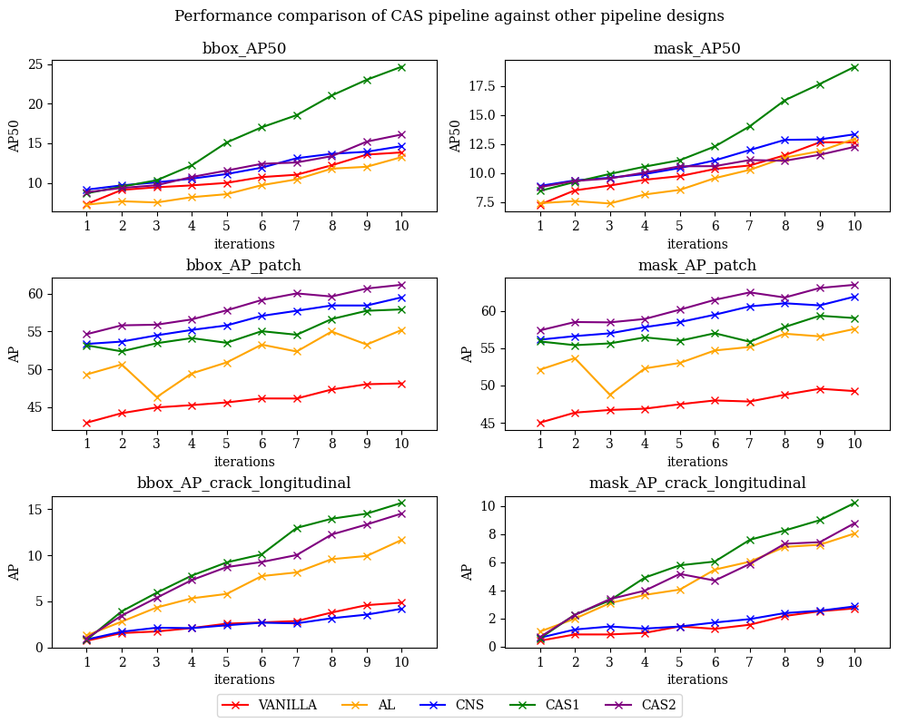

## CAS: Consistency-regularised Active learning for pavement defect Segmentation

This code repository is submitted as part of Fourth Year Project: "Semi-supervised learning for efficient labeling of large road image dataset" in Department of Engineering, University of Cambridge.

### Requirements
Setup anaconda environment with Python 3.9 using `environment.yaml` provided.
Separate installation of PyTorch version 1.13 and Detectron2 version 0.6 might be necessary.

### Running scripts
For simple predictions, locate images to run predictions in `data/predictions/raw` folder, then run `python prediction.py`. (Requires model weights file to be located under `models` folder: please contact for the files)

### Performance

### Acknowledgement and Reference
This repository contains code taken from [CSD-Detectron2](https://github.com/vlfom/CSD-detectron2) and [Detectron2](https://github.com/facebookresearch/detectron2). I appreciate their generosity of releasing the source code publicly and allowing to use them under suitable license conditions.

### Contact
martellw2ks@gmail.com